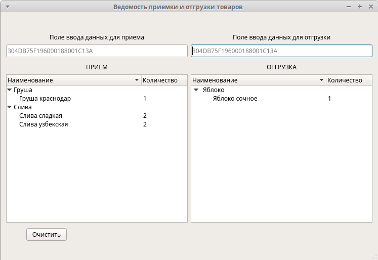

# cppInvent

# Ведомость приема и отгрузки товаров

### 1.  Общее описание Программного обеспечения
ПО предназначено для демонстрации сопоставления данных.

### 2. Назначение и область применения Программного обеспечения
ПО предназначено для работы на ПЭВМ.

### 3.  Функциональное назначение Программного обеспечения
ПО предназначено для выполнения функций:
* Формирование и редактирование справочника номенклатуры объектов данных;
*	Накопление и отображение вводимых данных в заданных областях интерфейса;
*	Демонстрацию взаимодействия данных в заданных областях интерфейса.

### 4.  Требования к функциям и интерфейсу Программного обеспечения
Интерфейс основного окна ПО позволяет переключаться в режим окна растянутого на весь экран и в оконный режим, а также позволяет изменить размеры окна. При изменении размеров окна положение элементов, их размеры и пространство между ними пропорционально изменяются. 

ПО позволяет выполнить формирование и редактирование ведомости приемки и отгрузки товаров из справочника номенклатуры, который должен содержать:
*	Идентификатор объекта, представляющий собой строку из **24-х HEX-символов**. Например, **304DB75F196000180001C13A**. Идентификатор объекта должен быть уникальным. Вводимые данные идентификаторов инвариантны к большим и маленьким буквам (прописным и строчным). При добавлении идентификатора строчные буквы автоматически преобразуются в прописные;
*	Наименование объекта.

Справочник номенклатуры содержится на ПЭВМ в виде файла, формат файла XML. 
Эскиз основного окна ПО приведен на Рис. 1.

ПО позволяет ввести в поля **«Поле ввода данных для приема»** и **«Поле ввода данных для отгрузки»** идентификаторов объекта, представляющих собой строку из **24-х HEX-символов**. Например, **304DB75F196000180001C13A**. ПО позволяет ввести как один идентификатор, так и группу из нескольких идентификаторов разделенных символом **ПРОБЕЛ « »**. Вводимые данные идентификаторов инвариантны к большим и маленьким буквам (прописным и строчным). При добавлении идентификатора строчные буквы автоматически преобразуются в прописные. 

После ввода в указанных полях символа перевода строки (нажатие клавиши **Enter**) ПО должно производит поиск введенных идентификаторов в справочнике номенклатуры и добавляет в соответствующую таблицу (**«ПРИЕМ»** или **«ОТГРУЗКА»**) наименование найденного объекта или увеличивает **«количество»** уже отображаемых объектов.

Отображаемые в таблицах объекты группируются (сворачиваются) по наименованиям. В случае добавления уже существующих в таблице объектов не формируется новая запись, увеличивается значение **«количество»** существующих объектов.

Если при добавлении в одну из таблиц (например, **«ПРИЕМ»**) объекта  из другой таблицы (**«ОТГРУЗКА»**), в которой объект с таким идентификатором уже существует – помимо добавления в таблицу **«ПРИЕМ»**, данный объект удаляется из таблицы **«ОТГРУЗКА»** (уменьшается количество или удаляется запись). Аналогично при добавлении в таблицу **«ОТГРУЗКА»**.

Идентификаторы не присутствующие в справочнике номенклатуры игнорируются.

При нажатии на кнопку **«Очистить»** ПО очищает таблицы **«ПРИЕМ»** и **«ОТГРУЗКА»**.
